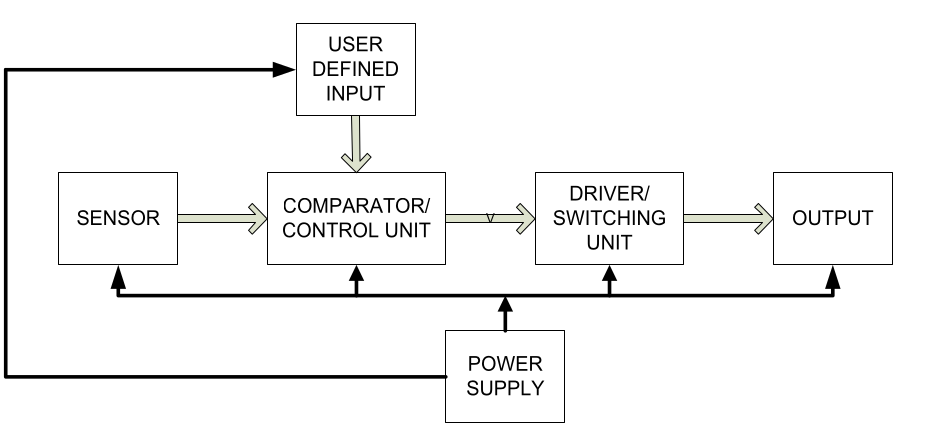
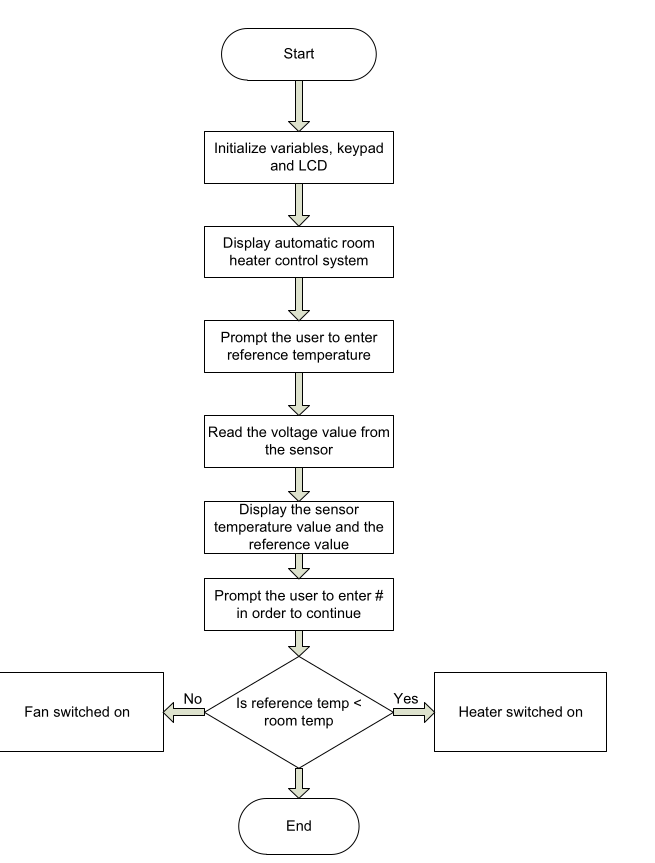

# 🔥 Basic Heater Control System – Embedded Project

## 📌 Problem Statement

Design and simulate a basic heater control system using a temperature sensor and microcontroller that automatically turns the heater **ON** or **OFF** based on ambient temperature thresholds.

---

## 🧰 Required Hardware Components

### ✅ Core Components

- **ESP32 Microcontroller**
  - Acts as the main control unit.
- **Temperature Sensor** (e.g., DHT22 / LM35 / DS18B20)
  - Measures ambient temperature.
- **Relay Module**
  - Controls the power to the heater.
- **LED Indicators**
  - Red LED: Heater ON  
  - Yellow LED: Normal Temperature
- **Resistors (220Ω)**
  - Current-limiting resistors for LEDs

### ⚙️ Optional Add-Ons

- **Humidity Sensor** – For climate control
- **RTC (DS3231)** – For time-based automation
- **EEPROM Module** – For profile storage
- **Bluetooth/Wi-Fi Module** – Remote control (ESP32 already supports this)
- **Current Sensor** – Monitor power usage

---

## 🔗 Communication Protocols

- **Digital I/O**
  - Used for reading temperature and controlling relay/LEDs.
- **Optional: I2C**
  - For modules like RTC or EEPROM (SCL & SDA lines).
- **Optional: 1-Wire Protocol**
  - Used by sensors like DS18B20.

---

## 📊 Block Diagram




---

## 🧠 System Working Principle


1. The temperature sensor sends data to the ESP32.
2. If the temperature drops **below 20°C**, the ESP32 **activates the relay** (heater ON).
3. If the temperature rises **above 25°C**, the ESP32 **turns off the relay** (heater OFF).
4. **LEDs** indicate heater status (red = heating, yellow = normal).
5. Real-time temperature is displayed on **Serial Monitor** or an **LCD (optional)**.

---

## 🔁 Workflow Summary

1. Sensor (DHT22) reads ambient temperature.
2. ESP32 evaluates the temperature value.
3. Based on the threshold:
   - Heater ON (relay HIGH) if temp < 20°C
   - Heater OFF (relay LOW) if temp > 25°C
4. LEDs signal the status of the heater.
5. System checks values every **10 seconds**.

---

## 🧪 Simulation

👉 [Wokwi Online Simulation](https://wokwi.com/projects/430561204477806593)  
> Simulated using ESP32, DHT22, and indicator LEDs.

---

## 🚀 Future Expansion Ideas

### 🔒 Overheating Protection
- Add a second sensor near the heater element.
- If local temperature > 70°C → Immediate shutdown via interrupt.

### 🛡️ Watchdog Timer & Hardware Cutoff
- Add WDT to reset ESP32 if unresponsive.
- Use analog comparator to cut heater power on system crash.

### 🧠 Heating Profiles & EEPROM
- Define user profiles like:
  - Comfort: 24°C
  - Eco: 22°C
  - Sleep: 18°C
- Store profiles in EEPROM and switch via button/Bluetooth.

### ⏰ Time-Based Automation
- Use **DS3231 RTC** to automate temperatures throughout the day.

### 📈 PID Control
- Replace threshold system with **PID algorithm** for precision control.

### 🌐 IoT Monitoring
- Use **ESP32 Wi-Fi/Bluetooth** for:
  - Temperature alerts
  - Mobile control
  - OTA updates

---

## 📁 Project Repository Structure

```plaintext
Heater-Control-System/
├── main.ino                # Main Arduino/ESP32 code
├── README.md               # Project documentation (this file)
├── circuit_diagram.png     # System block or wiring diagram
├── wokwi-project.json      # Wokwi simulation config
└── DESIGN.md               # Optional detailed design document
